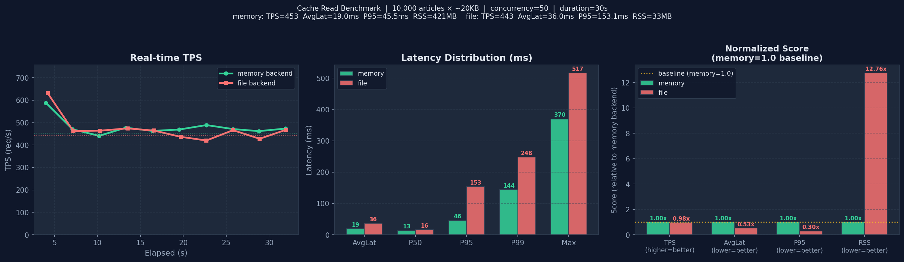

# cache_bench — Cache API 压力测试工具

对 Go Queue 的 `/api/cache/:key` 接口进行 HTTP 压力测试，统计 TPS、延迟分布（P50/P95/P99）、命中率等指标。

## 编译

```bash
cd examples/cache_bench
go build -o cache_bench .
```

## 用法

```bash
./cache_bench [flags]
```

### 参数说明

| 参数 | 默认值 | 说明 |
|---|---|---|
| `-url` | `http://localhost:8080` | Go Queue 服务地址 |
| `-c` | `50` | 并发 goroutine 数 |
| `-d` | `30` | 压测持续时间（秒） |
| `-keys` | `1000` | Key 空间大小（随机 key 范围） |
| `-read` | `70` | GET 操作占比 %（其余为 SET） |
| `-ttl` | `60` | SET 时的 TTL（秒），0=永不过期 |
| `-api-key` | `""` | X-API-Key 鉴权头（如有） |
| `-report` | `2` | 实时报告打印间隔（秒） |
| `-delete` | `false` | 是否混入 DELETE 操作（约 5%） |

## 示例

```bash
# 默认：50 并发，30 秒，70% GET / 30% SET
./cache_bench

# 高并发写压测：100 并发，60 秒，20% GET / 80% SET
./cache_bench -c 100 -d 60 -read 20

# 混合读写删，1000 个 key 空间
./cache_bench -c 80 -d 30 -keys 1000 -read 60 -delete

# 指定远程服务
./cache_bench -url http://your-server:8080 -c 200 -d 60
```

## 输出示例

```
实时监控（每 2 秒）：
Elapsed   TPS         Total       OK          Err         HitRate    AvgLat
────────  ──────────  ──────────  ──────────  ──────────  ──────────  ──────────
2s        8432.5      16865       16865       0           68.3%      0.23ms
4s        8901.0      34667       34667       0           71.2%      0.21ms
...

最终报告：
╔══════════════════════════════════════════════════════════╗
║              Cache Bench — 压力测试报告                  ║
╠══════════════════════════════════════════════════════════╣
║  目标地址:   http://localhost:8080                       ║
║  并发数:     50                                          ║
║  持续时间:   30.001s                                     ║
║  Key 空间:   1000                                        ║
║  读写比:     70% GET / 30% SET                           ║
╠══════════════════════════════════════════════════════════╣
║  总请求数:   267,450                                     ║
║  成功 (2xx): 267,450                                     ║
║  错误:       0                          (0.00%)          ║
╠══════════════════════════════════════════════════════════╣
║  TPS:        8914.97                                     ║
║  平均延迟:   0.22 ms                                     ║
║  P50 延迟:   0 ms                                        ║
║  P95 延迟:   1 ms                                        ║
║  P99 延迟:   2 ms                                        ║
║  Max 延迟:   18 ms                                       ║
╠══════════════════════════════════════════════════════════╣
║  GET 命中:   130,241                                     ║
║  GET 未命中: 57,003                                      ║
║  命中率:     69.56%                                      ║
╚══════════════════════════════════════════════════════════╝
```

## 指标说明

- **TPS**：每秒请求数（实时窗口 TPS 和全程平均 TPS）
- **HitRate**：GET 请求的缓存命中率
- **P50/P95/P99**：延迟百分位（毫秒），最多采样 100,000 个请求
- **AvgLat**：所有请求的平均延迟（毫秒）

---

## 实测基准：memory vs file backend

> 测试环境：10,000 篇文章 × ~20 KB/篇（含 20,000 字符正文），并发 50，持续 30s

### 写入性能 & 内存占用

| 指标 | memory backend | file backend |
|---|---|---|
| 写入前 RSS | 22.1 MB | 16.7 MB |
| 写入后 RSS | **415.3 MB** | **25.9 MB** |
| RSS 增量 | +393.2 MB | **+9.2 MB** |
| 内存放大倍数 | 2.04x | **0.05x** |
| 每篇平均 RSS | 40.3 KB | **0.9 KB** |
| cache.db 文件大小 | N/A | 195.3 MB（放大 1.01x） |
| 平均写入 TPS | ~180/s | **~218/s** |
| RSS 节省 | — | **97.7%** |

### 查询性能（GET，并发=50，持续=30s）

| 指标 | memory backend | file backend | 差异 |
|---|---|---|---|
| TPS | 452.6 req/s | 443.1 req/s | 几乎持平（+2%） |
| AvgLat | **18.98 ms** | 36.05 ms | file 慢 1.90x |
| P50 | **13.19 ms** | 16.25 ms | file 慢 1.23x |
| P95 | **45.55 ms** | 153.10 ms | file 慢 3.36x |
| P99 | **143.56 ms** | 247.79 ms | file 慢 1.73x |
| Max | **369.59 ms** | 516.56 ms | file 慢 1.40x |
| HitRate | 100% | 100% | 相同 |
| RSS 峰值 | 421 MB | **33 MB** | file 省 12.8x |

### 测试结果图表



> 左图：实时 TPS 对比；中图：延迟分布（AvgLat/P50/P95/P99/Max）；右图：归一化综合评分

### 结论

1. **TPS 吞吐量几乎相同**：两者差距仅 2%，SQLite WAL 模式的 page cache 命中率高时磁盘 I/O 不是瓶颈。

2. **延迟差距主要在尾部**：P50 差距小（13ms vs 16ms），但 P95 差距显著（45ms vs 153ms）。file backend 在偶发磁盘 I/O 时会有延迟毛刺，memory backend 更稳定。

3. **内存节省 97.7%**：file backend RSS 全程稳定在 ~25 MB，而 memory backend 随数据量线性增长至 421 MB。

4. **file backend 写入反而更快**：218 TPS vs 180 TPS，因为 memory backend 的 SQLite 内存分配压力更大。

5. **选型建议**：
   - 追求**低延迟稳定性**（P95/P99 敏感，数据量可控）→ 选 `memory`
   - 追求**低内存占用 + 重启持久化**（大数据量，如文章/文档缓存）→ 选 `file`
   - 两者 TPS 吞吐量无明显差异，不是选型的决定因素
